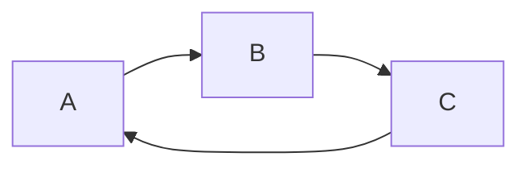

### 在Markdown中使用图片

#### Reference

- [用筆記也可以管理專案(一)：PlantUML](https://jonny-huang.github.io/projects/01_plantuml/)
- [用筆記也可以管理專案(二)：Markdown Preview Enhanced](https://jonny-huang.github.io/projects/02_markdown_preview_enhanced/)
- [Diagrams](https://github.com/shd101wyy/markdown-preview-enhanced/blob/master/docs/diagrams.md)
- [mermaid styles out of date](https://github.com/shd101wyy/markdown-preview-enhanced/issues/983)

#### Installation

首先安装Extension：`Markdown Preview Enhanced`，接着需要安装graphviz。

```bash
# Windows
choco install -y graphviz.portable
dot.exe -V

# Mac
brew cask install java
brew install graphviz
dot -V
```

#### Examples

```plantuml
A -> B
```

```puml
Bob -> Alice: Hello
Alice -> Bob: Go Away
```

@import "demo.puml"



```flow
st=>start: 开始
e=>end: 结束:>https://www.google.com
op=>operation: 我的操作
cond=>condition: 判断确认？
  
st->op->cond
cond(yes)->e
cond(no)->op
```

```vega-lite
{
  "$schema": "https://vega.github.io/schema/vega-lite/v2.json",
  "description": "A simple bar chart with embedded data.",
  "data": {
    "values": [
      {"a": "A","b": 28}, {"a": "B","b": 55}, {"a": "C","b": 43},
      {"a": "D","b": 91}, {"a": "E","b": 81}, {"a": "F","b": 53},
      {"a": "G","b": 19}, {"a": "H","b": 87}, {"a": "I","b": 52}
    ]
  },
  "mark": "bar",
  "encoding": {
    "x": {"field": "a", "type": "ordinal"},
    "y": {"field": "b", "type": "quantitative"}
  }
}
```

$f(x) = sin(x) + 12$

$$
    \begin{matrix}
    1 & x & x^2 \\
    1 & y & y^2 \\
    1 & z & z^2 \\
    \end{matrix}
$$

$$
    \begin{pmatrix}
    1 & x & x^2 \\
    1 & y & y^2 \\
    1 & z & z^2 \\
    \end{pmatrix}
$$

$$
f(n) =
\begin{cases}
n/2,  & \text{if $n$ is even} \\
3n+1, & \text{if $n$ is odd}
\end{cases}
$$

$$
{
e^x=\lim_{n\to\infty} \left( 1+\frac{x}{n} \right)^n
\qquad (2) 
}
$$
